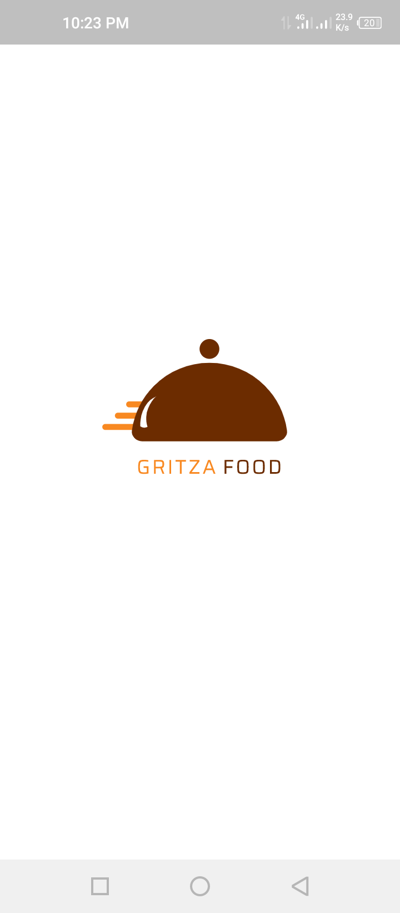
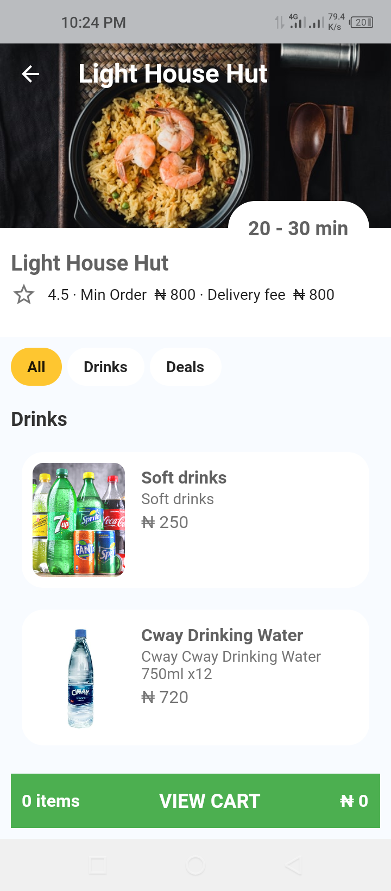
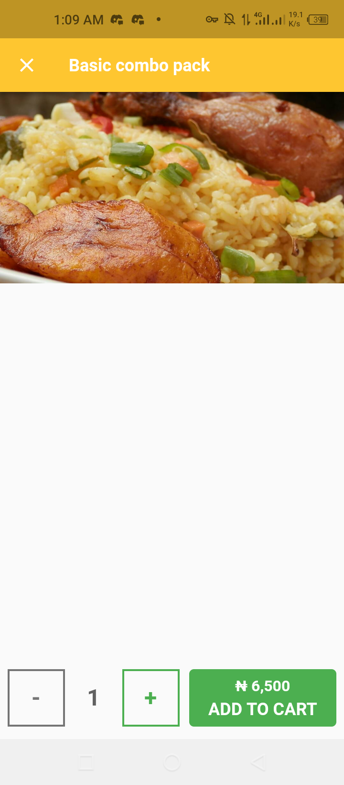

# Gritzafood

Gritza Food

# Flutter Food Ordering and Delivery Mobile Application 

## 🤓 Author(s)
**  Adeyemo Adekunle** 

## ScreenShots
### Splash Screen and Home Page
 &nbsp;&nbsp;&nbsp;&nbsp; 

### Food Details Screen & Add To Cart Screen
 &nbsp;&nbsp;&nbsp;&nbsp; 

### Login & Registration Screen
&nbsp;&nbsp;&nbsp;&nbsp; 

## ✨ Requirements
* Any Operating System (ie. MacOS X, Linux, Windows)
* Any IDE with Flutter SDK installed (ie.  Android Studio, VSCode, IntelliJ, etc)
* A little knowledge of Dart and Flutter
* A brain to think 🤓🤓

